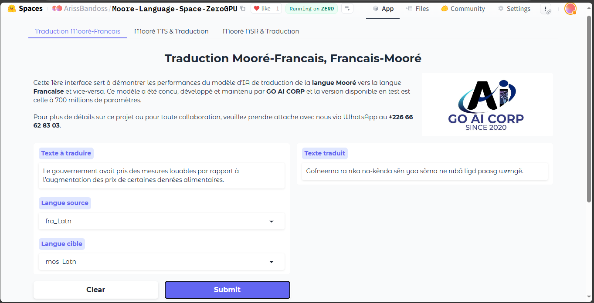
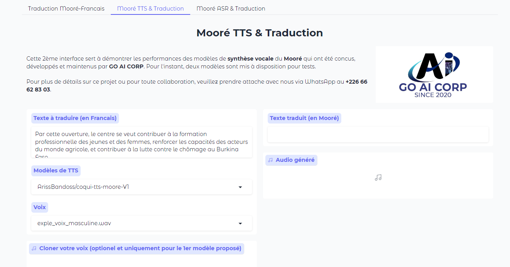
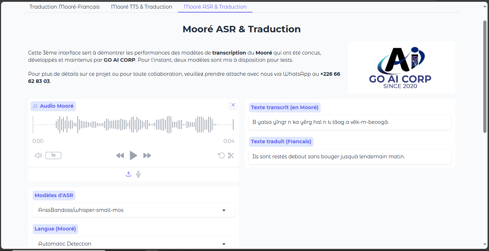

# Demo Space for Mooré language models developed by GO AI CORP: Text-to-Speech (TTS), Automatic Speech Recognition (ASR), and Translation from French to Mooré et vice-versa

# Space UI on Hugging Face 🤗

  
  
    

[Try Demo Here]([https://anyantudre-resemble-enhance-demo.hf.space](https://huggingface.co/spaces/ArissBandoss/Moore-Language-Space-ZeroGPU))  

## Have questions about this project or want to collaborate?

- **Aristide BANDAOGO:**
    - **E-mail:** aristide@goaicorporation.org
    - **[LinkedIn](https://www.linkedin.com/in/anyantudre/):** 
    - **WhatApp Contact:** +22666628303

- **Wendyellé A. Alban NYANTUDRE:**
    - **E-mail:** nyantudrealban@gmail.com
    - **[LinkedIn](https://www.linkedin.com/in/anyantudre/):** https://www.linkedin.com/in/anyantudre/
    - **WhatApp Contact:** +22671012083
